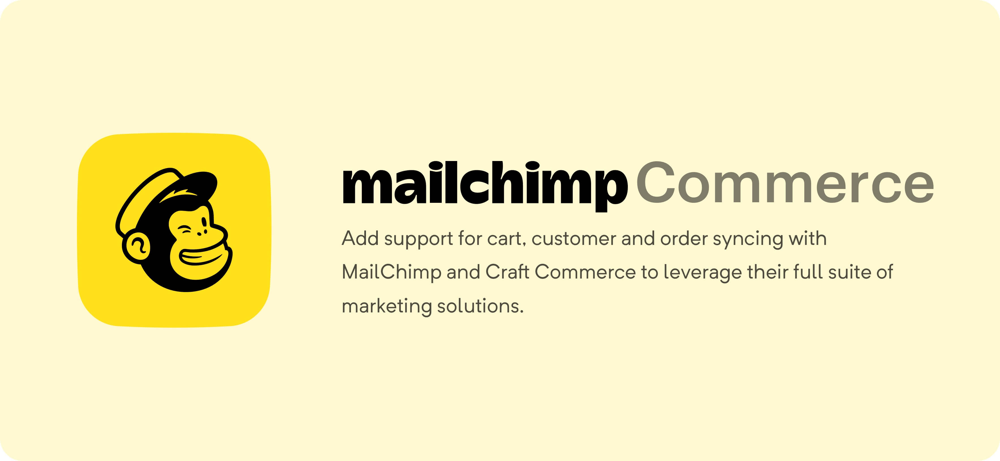
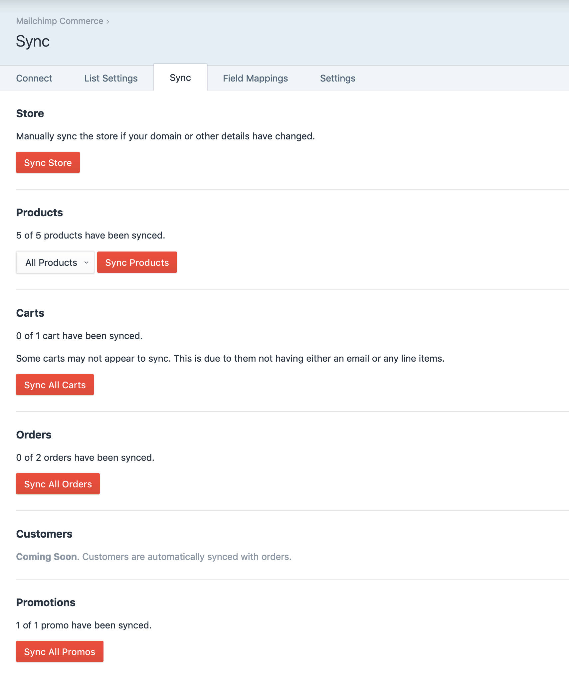
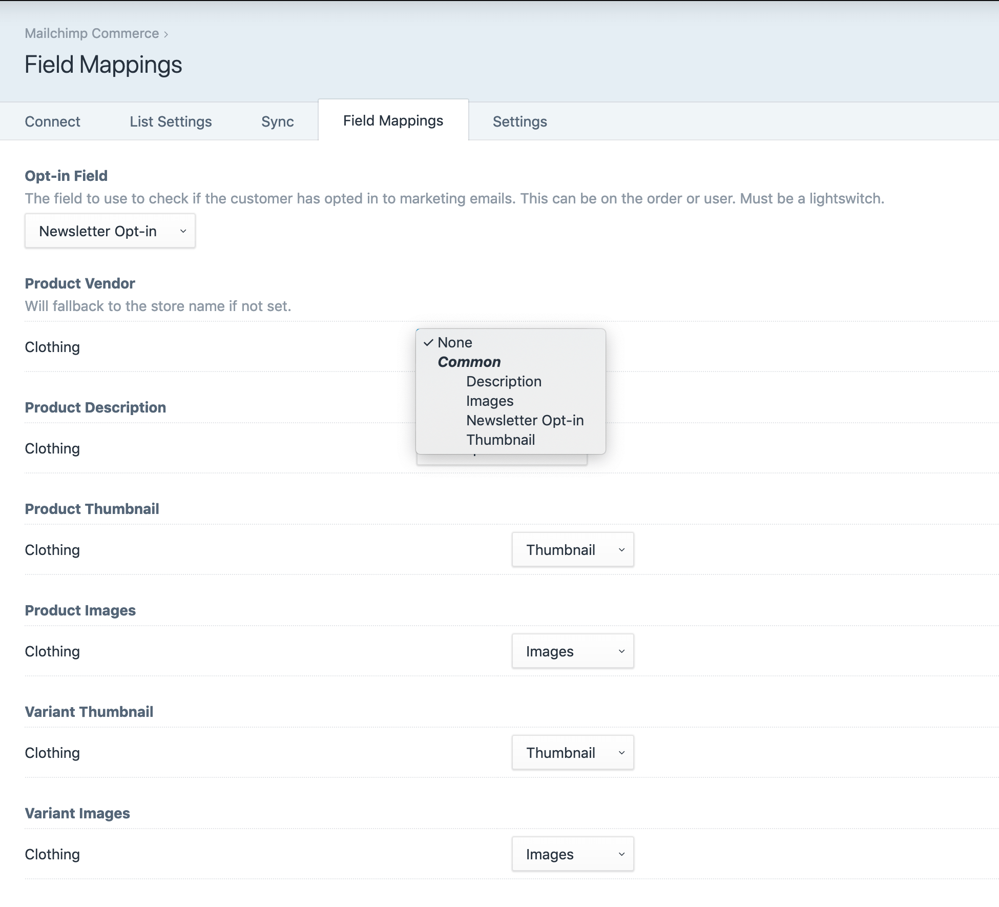
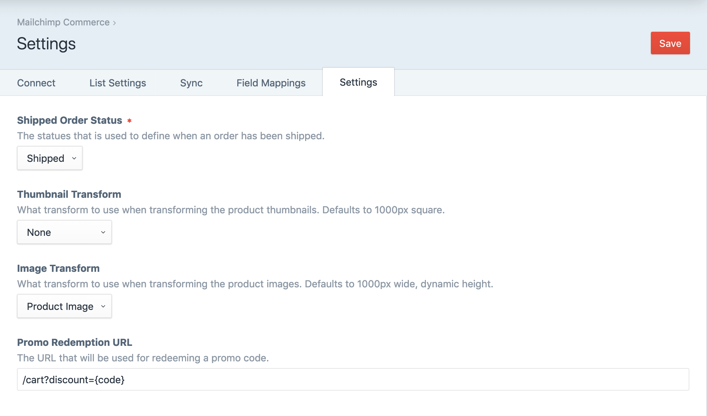

# Mailchimp for Craft Commerce
Sync your Store, Products, Carts, Orders, Customers, and Promotions to Mailchimp
and leverage their full suite of marketing solutions, including abandoned carts,
order status notifications, and more.









---

### Abandoned Carts emails aren't sending!

If you have an abandoned carts campaign setup but no emails are sending, it 
probably means you created the campaign before connecting your Craft site. 
You'll need to re-create the campaign via the "Connected Sites" section under 
your account menu in Mailchimp.

### Preventing Syncing

If you want to prevent anything from being synced (i.e. in your staging 
environment) you can do so by creating a Mailchimp Commerce config file 
(`mailchimp-commerce.php`) in your `config/` directory, and add the following:

```php
<?php

return [
	'staging' => [
		'disableSyncing' => true,
	],
];
```

You can use the config file to override any of the settings in the plugin. See
[`Settings.php`](./src/models/Settings.php) for all the settings. Be aware the 
some settings must not be modified.

### Local Development

Please note that Mailchimp requires a valid, publicly accessible URL for some of 
the data that is sync'd. This means that if you are using the plugin in a local 
environment that isn't externally accessible some sync tasks will fail. We 
recommend testing the plugin in a staging environment, or using a service like
[ngrok](https://ngrok.com/) to make your local environment public.

Check out our [blog post](https://ethercreative.co.uk/journal/ngrok-and-craft-cms)
on how to setup ngrok for Craft.

### Modifying Product Sync Data

You can modify the product data that is synced to Mailchimp using the "After 
build sync data" event.

```php
Event::on(
    \ether\mc\services\ProductsService::class,
    \ether\mc\services\ProductsService::EVENT_AFTER_BUILD_SYNC_DATA,
    function (\ether\mc\events\BuildSyncDataEvent $event) {
        $event->element; // The element being synced
        $event->syncData; // The resulting data to sync

        // For example, to modify the product description
        $event->syncData->description = $event->element->alternateDescriptionField;
    }
);
```
